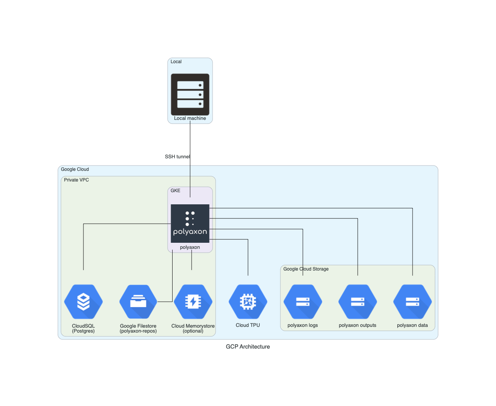

# Architecture Overview for Polyaxon

GKE, Cloud SQL, Cloud Filestore and Cloud Memorystore are located in the same private VPC to make them more secure and to make GKE connect to the rest of them.

- Google Kubernetes Engine is used to run polyason. We connect to containers of polyaxon API through SSH tunnel. The permission of GKE developer is required to make a SSH tunnel.
- Google Cloud SQL is used to store resulting metrics of polyaxon and so on.
- Google Filestore is used to store uploaded files in order to build docker images.
- Google Cloud Storage
  - data: A bucket is used to store data uploaded by polyaxon jobs.
  - output: A bucket is used to store outputs uploaded by polyaxon experiments.
  - logs: A bucket is used to store polyaxon logs.
- Google Cloud TPU can be used, when we specify TPU resources in polyaxon configurations.
- (Optional) Cloud Memorystore is used to stabilize polyaxon's queue with celery.

